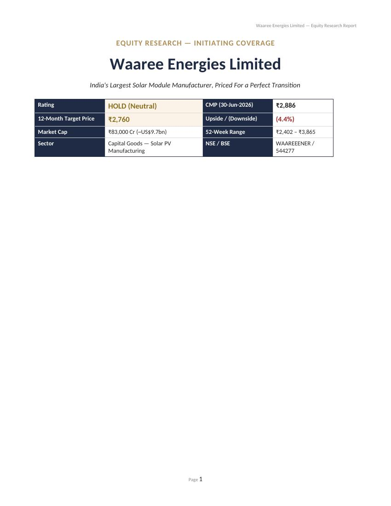
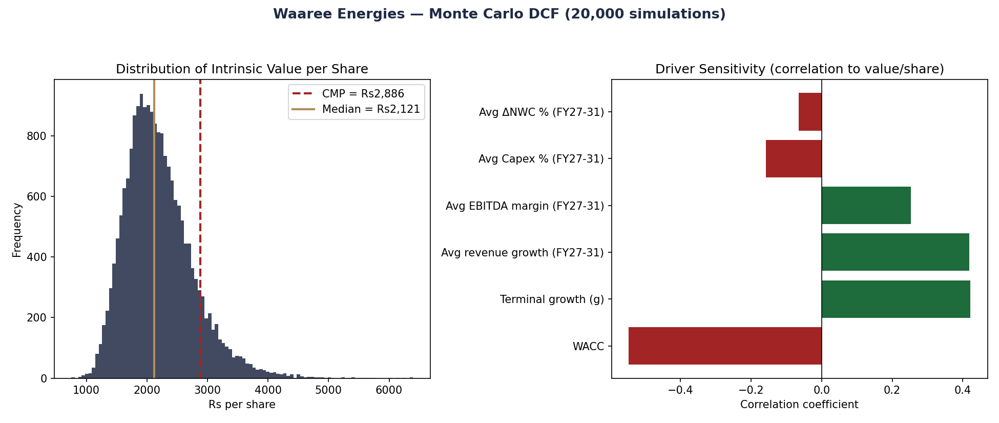
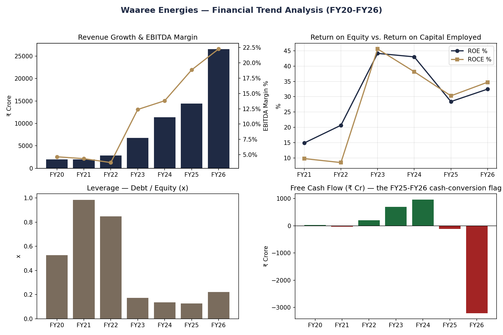
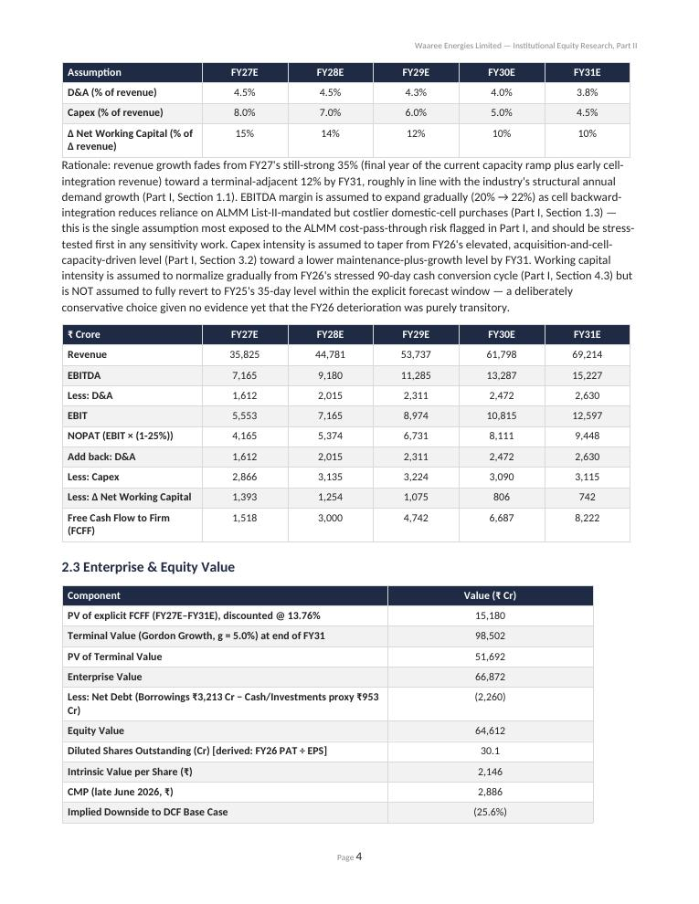
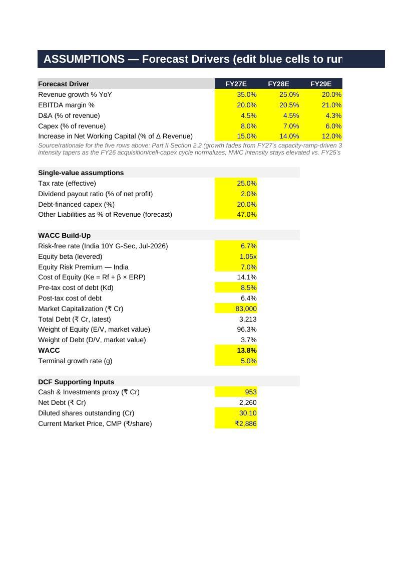
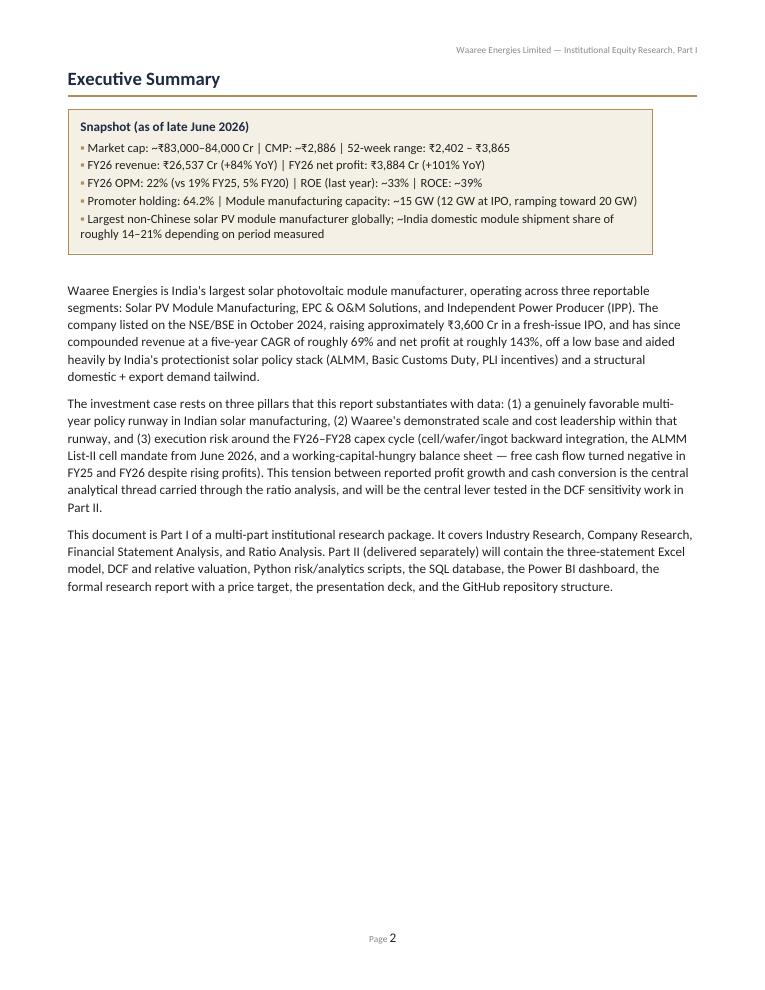

# Waaree Energies — Institutional Equity Research Package

End-to-end equity research on **Waaree Energies Limited** (NSE: WAAREEENER),
India's largest solar PV module manufacturer: industry & company research,
DCF and comparable-company valuation, a live 3-statement Excel model, a
Python Monte Carlo simulation, a SQL research database, a Power BI data
model + dashboard, and a final client-style research report with a
price target.

Built as an independent portfolio project — **not investment advice.**

## Headline finding

> DCF and peer-multiple valuations for Waaree disagree by roughly 60
> percentage points (₹2,146 vs. ₹3,900/share). A 20,000-path Monte Carlo
> simulation puts only an **~11% probability** that intrinsic value exceeds
> the ₹2,886 market price. The driver of that gap: FY26 net profit grew
> 101% YoY, but free cash flow turned to **-₹3,209 Cr** as the cash
> conversion cycle widened from 35 to 90 days — a real, disclosed
> deterioration that peer trading multiples don't obviously price in.
>
> **Rating: HOLD (Neutral) · 12-month target ₹2,760/share (-4.4% vs. CMP)**,
> from an explicit 65% DCF / 35% comps blend — see
> [`07_equity_research_report/`](07_equity_research_report/) for the full
> reasoning.

## Screenshots

| Rating & Price Target | Monte Carlo DCF (20,000 sims) |
|---|---|
|  |  |

| Ratio Trend Analysis (Python) | DCF Sensitivity Table (Excel) |
|---|---|
|  |  |

| Live Excel Assumptions Tab | Executive Summary (Word) |
|---|---|
|  |  |

## Contents

| Folder | What's inside |
|---|---|
| [`01_industry_company_research/`](01_industry_company_research/) | Industry research (market size, Porter's Five Forces, SWOT, policy landscape), company research (business model, governance, ESG), financial statement analysis, ratio analysis — FY20-FY26 |
| [`02_valuation_dcf_comps/`](02_valuation_dcf_comps/) | WACC build-up, 5-year FCFF forecast, DCF valuation, sensitivity table, comparable company analysis vs. Premier Energies / Vikram Solar / Websol |
| [`03_excel_model/`](03_excel_model/) | Fully dynamic 3-statement model (Assumptions → IS → BS → CF → Schedules → Ratios → DCF → Sensitivity → Checks), 529 live formulas, zero errors |
| [`04_python_analytics/`](04_python_analytics/) | Ratio engine, risk metrics (returns/vol/beta/Sharpe), **20,000-path Monte Carlo DCF simulation**, consolidated Excel export |
| [`05_sql_database/`](05_sql_database/) | SQLite schema (8 tables + 2 views), data loader, 14 tested queries (trend, CAGR, ratio, peer comparison, top/worst performers, DCF scenario queries) |
| [`06_powerbi/`](06_powerbi/) | Star-schema data model (Excel), full DAX measures library, dashboard wireframe spec, and a working interactive HTML preview of the dashboard |
| [`07_equity_research_report/`](07_equity_research_report/) | The final, client-style report: investment thesis, rating box, price target derivation, catalysts, risks, appendix |

## How to run the code

**Python (Part 4):**
```bash
cd 04_python_analytics
pip install -r requirements.txt
python 02_ratio_analysis.py      # no internet needed
python 04_monte_carlo.py         # no internet needed — the headline Monte Carlo result
python 01_data_import.py         # needs internet — pulls real prices via yfinance
python 03_risk_metrics.py        # auto-detects real prices if 01 was run, else uses labeled illustrative data
python 05_export_master_workbook.py
```

**SQL (Part 5):**
```bash
cd 05_sql_database
python load_data.py              # rebuilds waaree_research.db
# then open queries.sql in any SQLite client, or:
python3 -c "import sqlite3; [print(r) for r in sqlite3.connect('waaree_research.db').execute(open('queries.sql').read().split(';')[0])]"
```

**Power BI (Part 6):** import `Waaree_PowerBI_DataModel.xlsx` into Power BI
Desktop (Get Data → Excel Workbook, select all tables), set up relationships
per `DAX_Measures.md` §1, paste in the measures, build pages per
`Dashboard_Layout_Spec.md`. Open `Waaree_Dashboard_Preview.html` directly in
any browser for a working preview first.

## Methodology notes & limitations (stated up front, not hidden)

- Historicals (FY20-FY26) sourced from company filings via Screener.in;
  FY20-FY24 predate Waaree's Oct-2024 IPO and come from RHP/pre-listing filings.
- Net debt and shares outstanding in the valuation are approximated/derived
  rather than pulled from a precise cash schedule — flagged explicitly in
  Part 2 and the Excel model rather than silently assumed.
- Live market-price data (stock returns, beta, Power BI stock-price page)
  was generated in a sandboxed environment with no market-data network
  access; every such output is explicitly labeled **"ILLUSTRATIVE DATA"**
  in its script, chart, and file — never presented as real. Re-run
  `01_data_import.py` with internet access to replace it with live data.
- The DCF vs. comps weighting (65/35) in the final report is a stated
  analytical judgment, not the only defensible split — the report shows
  the alternative (50/50 → +4.7% upside) explicitly.

## License

No license — this is a personal research/portfolio project, shared for
educational purposes. Company data belongs to Waaree Energies Limited and
its filings; treat this repository's analysis as independent commentary,
not affiliated with or endorsed by the company.
